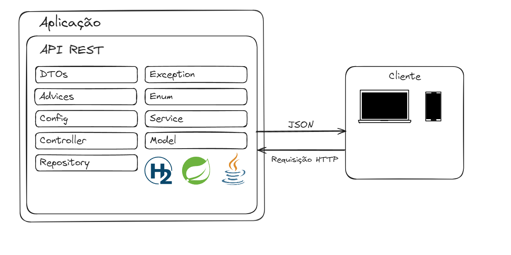

# <p style="text-align: center;">Beneficiário Plano de Saúde 💉</p>

## 🔌 Como Executar o Projeto

Antes de começar, certifique-se de ter um ambiente com JDK 17 instalado

Para executar o projeto, siga os seguintes passos:

1. Abra o projeto com o Editor/IDE de sua preferência


2. Faça o download das dependências do projeto. Caso seu Editor/IDE não faça automaticamente execute o comando:
    ```
       mvn dependency:copy-dependencies
    ```
3. Pronto. Agora é só compilar e iniciar a aplicação

## 🔌 Endpoints

A aplicação expõe uma rota com SwaggerUI (`/docs/`) para testar os endpoints 

## 📏  Aquitetura e padrões utilizados 

 - [x] Validação de payloads com Bean Validation
 - [x] Mapeamento de DTOs para Entidades com ModelMapper
 - [x] Documentação padrão OpenApi Com SpringDoc

## 💻 Tecnologias


 <strong>H2 database</strong>


## 👨🏽‍💻 Autor

**Lucas Mathias**

[](https://www.linkedin.com/in/lucas-mathias-729a27181/)
[](mailto:lucasmathias936@gmail.com)